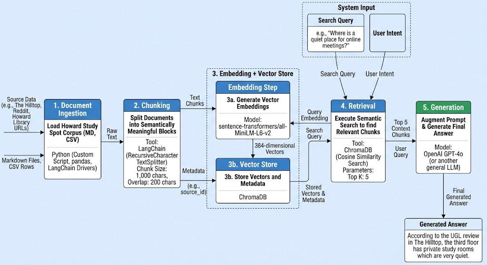

# Project 1 Planning: The Unofficial Guide

> Write this document before you write any pipeline code.
> Your spec and architecture diagram are what you'll use to direct AI tools (Claude, Copilot, etc.) to generate your implementation — the more specific they are, the more useful the generated code will be.
> Update the Retrieval Approach and Chunking Strategy sections if you change your approach during implementation.
> Update this file before starting any stretch features.

---

## Domain

<!-- What domain did you choose? Why is this knowledge valuable and hard to find through official channels? -->
My domain topic I chose was where on Howard's campus and the surrounding DC area that students can study, work on projects and assignments, or hangout. This knowledge is valuable because every student will usually want an area like this for focus and concentration. Certain things are easily found in official channels like open hours for different places, but other metrics like scenery or noise level will mainly be things that students discuss themselves.
---

## Documents

<!-- List your specific sources: URLs, subreddit names, forum threads, or file descriptions.
     Aim for at least 10 sources that together cover different subtopics or perspectives within your domain. -->

| # | Source | Description | URL or location |
|---|--------|-------------|-----------------|
| 1 |Best Places To Study On Campus |Howard's student led newspaper detailing the different options of on-campus study spots. |https://thehilltoponline.com/2023/08/21/best-places-to-study-on-campus/ |
| 2 |Seven Places to Study on Howard's Campus |Short student testimonies are given on a few different on-campus study and hangout spots. |https://thedig.howard.edu/all-stories/seven-places-study-howards-campus |
| 3 |Howard Founders Library |The Founders Library Main page with guide detailing facilities, quiet study zones, private desk availability, and historical archive spaces. |https://founders.howard.edu/ |
| 4 |Howard Business Library |Business Library Main page with info on facilities, operating hours, how to properly acess, and specialized research environment rules. |https://businesslibrary.howard.edu/ |
| 5 |r/Howard University - Where is a quiet place on campus that I can take a meeting uninterrupted |Thread about where on campus students could find a place to do online meetings without distractions |https://www.reddit.com/r/HowardUniversity/comments/1qjt4e2/where_is_a_quiet_place_on_campus_that_i_can_take/ |
| 6 |Louis Stokes Health Science Library About Page |Short overview of the Howard health science library including operating hours and location on campus. |https://hsl.howard.edu/library/about |
| 7 |Study and Remote Work Locations in DC |Spreadsheet detailing a selection of study spots around D.C., also including amenities like whether or not the spaces have free wifi and the like. |https://docs.google.com/spreadsheets/d/1SzIld1R8k2QeIKut5YacZTwVTanlP2O3ZxWdvn-XFv0/edit?gid=1240342982#gid=1240342982 |
| 8 |r/washingtondc - Most beautiful places to study/read in DC? |A thread where people share the spots that they think are the most beautiful for studying or reading around the city. |https://www.reddit.com/r/washingtondc/comments/8rh2bj/most_beautiful_places_to_studyread_in_dc/ |
| 9 |r/washingtondc - Underrated study spots |A thread where people share what they consider niche study spots around D.C. |https://www.reddit.com/r/washingtondc/comments/1kggh4w/underrated_study_spots/ |
| 10 |r/washingtondc - Best Cafes in DC for working or studying? |A thread dedicated to specifically cafes around D.C. suitable for studying and getting work done. |https://www.reddit.com/r/washingtondc/comments/1521vi4/best_cafes_in_dc_for_working_or_studying/ |

---

## Chunking Strategy

<!-- How will you split documents into chunks?
     State your chunk size (in tokens or characters), overlap size, and explain why those
     numbers fit the structure of your documents.
     A review-heavy corpus warrants different chunking than a long FAQ. -->

**Chunk size:**
I'm going to do chunk sizes of 200-250 words. (Aka 1000-1200 chars.)

**Overlap:**
Overlap is going to be 30-40 words. (Aka 150-200 chars.)

**Reasoning:**
My sources are split into three categories: official web pages, online discussion forums, and journalistic ranking lists. For sources 1 and 2, the chunks work since they are both ranking lists so each chunk is basically each separate ranking. For the reddit sources, users don't usually make long responses maybe besides the OP that starts threads so 200-250 words should cover most dialogues. And then for web pages plus my one spreadsheet, information is the most dense so the overlap should work to make sure nothing is missed for these.
---

## Retrieval Approach

<!-- Which embedding model are you using (e.g., all-MiniLM-L6-v2 via sentence-transformers)?
     How many chunks will you retrieve per query (top-k)?
     If you were deploying this for real users and cost wasn't a constraint, what tradeoffs
     would you weigh in choosing a different embedding model — context length, multilingual
     support, accuracy on domain-specific text, latency? -->

**Embedding model:**
all-MiniLM-L6-v2

**Top-k:**
Top-k will be 3-5.

**Production tradeoff reflection:**
If there were no cost restraints I'd use a different model like the voyage-3 because it offers way more tokens and dimensions. It means I would be able to easily capture the full context of my sources and probably make them broader and it would still work.
---

## Evaluation Plan

<!-- List your 5 test questions with their expected correct answers.
     Questions should be specific enough that you can judge whether the system's response
     is right or wrong. "What are good dining halls?" is too vague.
     "What do students say about wait times at [dining hall name] during lunch?" is testable. -->

| # | Question | Expected answer |
|---|----------|-----------------|
| 1 |What libraries would still be open around Howard's campus on weekends past 12:00 pm?  |The libraries that are open would include Founders (Saturdays and Sundays), Busineess Library (Saturdays and Sundays), Undergraduate Library (Saturdays and Sundays), and the Health Science Library (Saturdays and Sundays). |
| 2 |I have an online assignment due soon but I'm nowhere near the Howard Campus right now, where can I go in the city to work that has wifi I can use to submit this real quick? |Bourbon Coffee, Solid State Books, Yoube Cafe, Kaldi's Social House, Capitol One Cafe, Tynan Coffee and Tea, Compass Coffee, Grace Street Coffee, Panera Bread, Rue Cafe, Tryst, Jacob Coffee House, The Den - Politics and Prose, Boundary Stone, Kramerbooks & Afterwords Cafe, Library of Congress, and Three Fifty Bakery and Cofffee Bar. |
| 3 |What do other students say about some of the study spaces at Howard? |Students at Howard have good things to say about the study spaces like how Abraham Cleveland of the class of '23 remarks that the Locke Hall Writing Center "has lots of natural lighting with a huge table that allows me to spread out my work." |
| 4 |Any underrated or niche spots at Howard that I should know about whenever I want to go study in peace. |Sure, their are some underrated spots like Miner Hall or any building with a empty classroom since those have wifi, outlets, and A.C. There is also  |
| 5 |Any outside study or lounge areas on campus where I can meet people? |Yes, there is the Caribbean tree on The Yard of Howard. Since it is on The Yard, students walking by is a common site meaning you can easily run into new people or people you know.|

---

## Anticipated Challenges

<!-- What could go wrong? Name at least two specific risks with reasoning.
     Consider: noisy or inconsistent documents, missing source attribution, off-topic
     retrieval, chunks that split key information across boundaries. -->

1. One problem may be confusion between on campus options versus surrounding D.C. general city options. There could easily be unwanted overlaps when answering user questions since some off campus options are quite close to Howard. Or that Howard options are also included in D.C. general options since Howard exists in D.C. and that logic is followed instead.

2. Another issue could be whether the answers contain relevant up to date data. Since cities change so much, especially D.C., certain spots could be gone, rennovated, have their operating hours change dynamically instead of a fixed schedule, etc. so there is potential that the system could give out of date information alongside up to date information which can be confusing to the user.

---

## Architecture

<!-- Draw a diagram of your pipeline showing the five stages:
     Document Ingestion → Chunking → Embedding + Vector Store → Retrieval → Generation
     Label each stage with the tool or library you're using.
     You can use ASCII art, a Mermaid diagram, or embed a sketch as an image.
     You'll use this diagram as context when prompting AI tools to implement each stage. -->

---

## AI Tool Plan

<!-- For each part of the pipeline below, describe:
     - Which AI tool you plan to use (Claude, Copilot, ChatGPT, etc.)
     - What you'll give it as input (which sections of this planning.md, which requirements)
     - What you expect it to produce
     - How you'll verify the output matches your spec

     "I'll use AI to help me code" is not a plan.
     "I'll give Claude my Chunking Strategy section and ask it to implement chunk_text()
     with my specified chunk size and overlap" is a plan. -->

**Milestone 3 — Ingestion and chunking:**

**Milestone 4 — Embedding and retrieval:**

**Milestone 5 — Generation and interface:**
